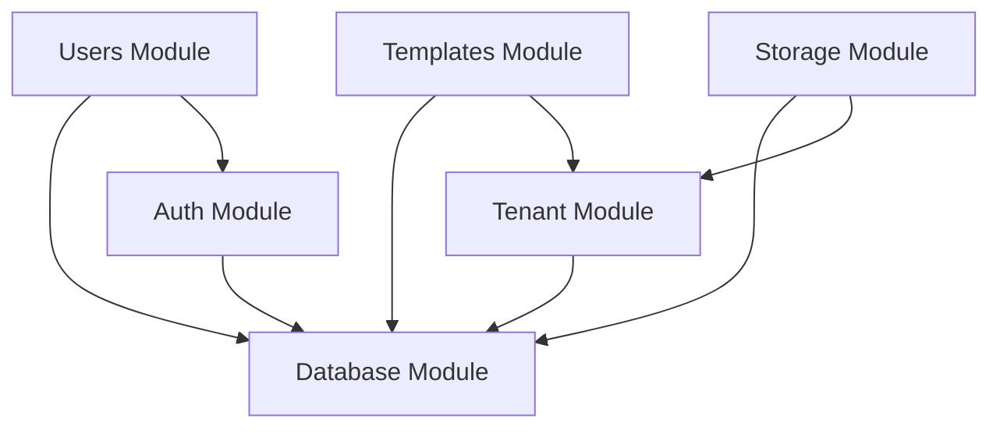

# Architecture Documentation

Comprehensive architecture documentation for the Complytude platform.

## Table of Contents

- [System Overview](#system-overview)
- [Technology Stack](#technology-stack)
- [Architecture Patterns](#architecture-patterns)
- [Module Architecture](#module-architecture)
- [Database Architecture](#database-architecture)
- [Multi-Tenancy Implementation](#multi-tenancy-implementation)
- [Authentication & Authorization](#authentication--authorization)
- [Storage Architecture](#storage-architecture)
- [API Design](#api-design)
- [Security Architecture](#security-architecture)

---

## System Overview

Complytude is a **multi-tenant SaaS platform** for UAE legal document generation and compliance management, built with modern backend architecture principles. The system is organized as a monorepo with multiple applications.

### High-Level Architecture

```
┌─────────────────────────────────────────────────────────────────┐
│                        Client Layer                              │
│  Web App (React/Next.js) • Mobile App • API Consumers           │
└─────────────────────────────────────────────────────────────────┘
                              ↓
┌─────────────────────────────────────────────────────────────────┐
│                     API Gateway / Load Balancer                  │
│                      (nginx / AWS ALB)                           │
└─────────────────────────────────────────────────────────────────┘
                              ↓
┌─────────────────────────────────────────────────────────────────┐
│                   NestJS API Application                         │
│  ┌───────────┬───────────┬─────────────┬──────────────────────┐ │
│  │   Auth    │  Tenants  │  Templates  │  Documents           │ │
│  │  Module   │  Module   │   Module    │   Module             │ │
│  ├───────────┼───────────┼─────────────┼──────────────────────┤ │
│  │  RBAC     │ Entitle-  │  Rulesets   │  Subscriptions       │ │
│  │ (T + P)   │  ments    │   Module    │   Module             │ │
│  ├───────────┼───────────┼─────────────┼──────────────────────┤ │
│  │  Storage  │   Audit   │  Users      │  Health / Mock       │ │
│  │  Module   │  Module   │  Module     │   Modules            │ │
│  └───────────┴───────────┴─────────────┴──────────────────────┘ │
│  ┌──────────────────────────────────────────────────────────┐   │
│  │  Common: Guards, Interceptors, Pipes, Decorators        │   │
│  └──────────────────────────────────────────────────────────┘   │
└──────────────────────┬──────────────────────────────────────────┘
                       │ BullMQ (via Redis)
          ┌────────────┴────────────┐
          ↓                         ↓
┌──────────────────┐    ┌────────────────────────┐
│  Worker AI App   │    │  Worker Ingestion App  │
│  (LLM analysis)  │    │  (chunk + embed)       │
└──────────────────┘    └────────────────────────┘
                              ↓
┌─────────────────────────────────────────────────────────────────┐
│                      Data & Infrastructure Layer                 │
│  ┌──────────────┬──────────────┬──────────────┬──────────────┐ │
│  │ PostgreSQL 16│    Redis 7   │ S3-Compatible│  OpenAI API  │ │
│  │ + pgvector   │  (BullMQ)    │ (MinIO/AWS)  │ (Embeddings) │ │
│  └──────────────┴──────────────┴──────────────┴──────────────┘ │
└─────────────────────────────────────────────────────────────────┘
```

### Key Architectural Decisions

| Decision             | Choice                    | Rationale                                         |
| -------------------- | ------------------------- | ------------------------------------------------- |
| **Framework**        | NestJS 11 with Fastify    | Performance, modularity, TypeScript-first         |
| **Database**         | PostgreSQL 16 + pgvector  | JSONB support, RLS, vector similarity search      |
| **Multi-Tenancy**    | Row-Level Security (RLS)  | Strong data isolation at database level           |
| **Authentication**   | JWT with Passport         | Stateless, scalable, industry standard            |
| **Background Jobs**  | BullMQ + Redis            | Reliable job processing, typed payloads           |
| **AI/LLM**          | OpenAI API                | Document analysis, embedding generation           |
| **Storage**          | S3-compatible (MinIO/AWS) | Scalable, tenant-isolated buckets                 |
| **Validation**       | class-validator           | Declarative, type-safe validation                 |
| **Documentation**    | Swagger/OpenAPI           | Auto-generated, interactive API docs              |

---

## Technology Stack

### Backend Framework

- **NestJS 11** - Modern TypeScript framework with dependency injection
- **Fastify** - High-performance HTTP server
- **TypeScript 5.7** - Type safety and modern JavaScript features

### Database

- **PostgreSQL 16 + pgvector** - Relational database with vector similarity search
- **Raw SQL** - Direct SQL via native `pg` driver (no ORM)
- **Row-Level Security (RLS)** - Database-level tenant isolation

### Background Jobs & Messaging

- **BullMQ** - Redis-backed job queue for async processing
- **Redis 7** - Message broker for BullMQ, connection management via ioredis

### AI & Machine Learning

- **OpenAI API** - Document analysis, embedding generation
- **tiktoken** - Token counting for chunking
- **pgvector** - Vector similarity search for semantic retrieval

### Authentication & Security

- **Passport.js** - Authentication middleware
- **JWT** - Dual-token stateless authentication (identity + tenant)
- **bcrypt** - Password hashing
- **class-validator** - Input validation

### Storage

- **MinIO** (Development) - S3-compatible object storage
- **AWS S3** (Production) - Cloud object storage

### Documentation

- **Swagger/OpenAPI** - API documentation

### DevOps

- **Docker** - Containerization (base + dev + prod overlays)
- **Docker Compose** - Local development orchestration
- **pnpm** - Fast, disk-efficient package manager

### Shared Libraries (`libs/`)

- **@lib/database** - Database module, service, base repository
- **@lib/embedding** - OpenAI embedding + text chunking
- **@lib/queue** - BullMQ queue module + typed producer
- **@lib/redis** - Redis connection management

---

## Architecture Patterns

### 1. Clean Architecture

Complytude follows clean architecture principles with clear separation of concerns:

```
apps/api/src/
├── modules/              # Feature modules (17 total)
│   ├── auth/            # JWT authentication & token management
│   ├── audit/           # Audit logging
│   ├── authorities/     # Regulatory authorities
│   ├── categories/      # Template categories
│   ├── documents/       # Document generation & management
│   ├── entitlements/    # Plan-based feature access, usage, credits
│   ├── health/          # Health checks
│   ├── invitations/     # Tenant invitations
│   ├── mock/            # Dev/test mock controllers
│   ├── platform-rbac/   # Platform-wide authorization
│   ├── rulesets/        # Compliance rulesets
│   ├── storage/         # S3 file storage
│   ├── subscriptions/   # Subscription management
│   ├── tenant-rbac/     # Tenant-scoped authorization
│   ├── tenants/         # Multi-tenancy management
│   ├── templates/       # Template CRUD & versioning
│   └── users/           # User management
├── common/              # Cross-cutting concerns
│   ├── guards/         # Authorization guards (RBAC, entitlement, usage)
│   ├── interceptors/   # Request/response transformation (tenant, audit)
│   ├── decorators/     # Custom decorators (permissions, entitlement, audit)
│   ├── exceptions/     # Custom exceptions
│   ├── pipes/          # Validation pipes
│   └── utils/          # Utilities (permission matching, billing, etc.)
├── config/             # Configuration management
├── database/           # Re-exports from @lib/database (deprecated)
├── repositories/       # Data access layer
└── i18n/               # Internationalization
```

### 2. Dependency Injection

All services use NestJS's DI container:

```typescript
@Injectable()
export class TemplateService {
  constructor(
    private readonly databaseService: DatabaseService,
    private readonly storageService: StorageService,
  ) {}
}
```

**Benefits:**

- Loose coupling
- Easy mocking and modularity
- Clear dependencies

### 3. Decorator-Based Authorization

Authorization is handled via decorators and guards at the route level:

```typescript
@AuthOptions({ tenant: true })
@UseGuards(TenantPermissionsGuard)
@RequireAnyTenantPermission('documents:read')
@Get()
async findAll(@CurrentUserTenant() user: AuthenticatedTenantUser) {
  return this.service.findAll(user.tenantId);
}
```

### 4. DTO Validation

All inputs are validated using DTOs:

```typescript
export class CreateTemplateDto {
  @IsString()
  @IsNotEmpty()
  name: string;

  @IsUUID()
  categoryId: string;

  @IsOptional()
  @IsEnum(TemplateStatus)
  status?: TemplateStatus;
}
```

---

## Module Architecture

### Module Structure

Each module in the API application follows a consistent structure:

```
apps/api/src/modules/feature/
├── feature.module.ts        # Module definition
├── feature.controller.ts    # HTTP endpoints
├── feature.service.ts       # Business logic
├── dto/                     # Data Transfer Objects
│   ├── create-feature.dto.ts
│   └── update-feature.dto.ts
└── entities/                # Type definitions (optional)
    └── feature.entity.ts
```

### Module Dependencies



### Core Modules

| Module              | Responsibility                                                          | Dependencies                 |
| ------------------- | ----------------------------------------------------------------------- | ---------------------------- |
| **auth**            | JWT authentication, signup, login, token refresh, invitation flows      | users, invitations, database |
| **users**           | User management, profile updates                                        | database                     |
| **tenants**         | Tenant creation, management, invitations                                | users, database              |
| **invitations**     | Tenant invitations, accept/reject                                       | users, tenants, database     |
| **tenant-rbac**     | Tenant-scoped RBAC (Global)                                             | database                     |
| **platform-rbac**   | Platform-wide RBAC (Global)                                             | database                     |
| **entitlements**    | Plan-based feature access, usage tracking, credit system (Global)       | database, subscriptions, queue |
| **subscriptions**   | Subscription lifecycle (create, change plan, cancel, renew)             | database                     |
| **audit**           | Audit logging (Global)                                                  | database                     |
| **authorities**     | Regulatory authority management                                         | database                     |
| **categories**      | Template category management                                            | database                     |
| **templates**       | Template CRUD, versioning, field extraction                             | storage, database            |
| **rulesets**        | Compliance rulesets with versioning                                      | database                     |
| **documents**       | Document generation and management                                      | templates, storage, database |
| **storage**         | File upload/download, S3 integration                                    | database                     |
| **health**          | Health checks for services                                              | database, redis              |
| **mock**            | Development/testing mock endpoints                                      | entitlements, rbac           |

---

## Database Architecture

### Schema Overview

The database uses a **multi-tenant architecture** with Row-Level Security (RLS) for data isolation.

**For detailed database documentation, see [DATABASE.md](DATABASE.md)**

### Table Categories (38+ tables)

1. **Core Tables** (3) - `tenants`, `users`, `user_tenants`
2. **Tenant RBAC Tables** (3) - `tenant_roles`, `tenant_permissions`, `tenant_role_permissions`
3. **Platform RBAC Tables** (3) - `platform_roles`, `platform_permissions`, `platform_role_permissions`
4. **Authentication Tables** (4) - `refresh_tokens`, `email_verifications`, `password_resets`, `invitations`
5. **Global Reference Tables** (6) - `authorities`, `categories`, `templates`, `template_versions`, `rulesets`, `ruleset_versions`
6. **Entitlement Catalog Tables** (5) - `features`, `plans`, `plan_entitlements`, `addons`, `addon_entitlements`
7. **Tenant-Scoped Entitlement Tables** (3) - `tenant_subscriptions`, `tenant_addons`, `tenant_overrides`
8. **Event Ledgers** (3) - `usage_ledger`, `usage_allocations`, `credit_ledger`
9. **Projections & Snapshots** (2) - `aggregated_usage`, `entitlement_snapshots`
10. **Domain Events** (1) - `domain_events`
11. **Tenant-Scoped Tables** (1) - `documents`
12. **Audit Tables** (1) - `audit_logs`
13. **Junction Tables** (4) - `template_rulesets`, `template_version_ruleset_versions`, `tenant_role_permissions`, `platform_role_permissions`

### ER Diagram

View the complete ER diagram:

**📁 File:** `docs/database-schema.dbml`

**View online:**

1. Go to [dbdiagram.io](https://dbdiagram.io/)
2. Copy contents of `database-schema.dbml`
3. Paste into editor

---

## Multi-Tenancy Implementation

### Strategy: Row-Level Security (RLS)

Complytude uses PostgreSQL's Row-Level Security for tenant isolation:

**Advantages:**

- ✅ Strong isolation at database level
- ✅ No application-level filtering needed
- ✅ Automatic enforcement (can't be bypassed)
- ✅ Minimal performance overhead

### How It Works

1. **Application uses transaction with tenant context:**

   ```typescript
   // DatabaseService handles context setup automatically
   await this.databaseService.transactionWithTenantContext(
     { tenantId, isTenantAdmin: true },
     async (client) => {
       // All queries within this callback have RLS context set:
       //   app.tenant_id = tenantId
       //   app.is_tenant_admin = 'true'
       //   app.allow_cross_tenant_read = 'false'
       const result = await client.query('SELECT * FROM documents');
       return result.rows;
     },
   );

   // For system-wide operations (bypasses tenant RLS):
   await this.databaseService.transactionWithPlatformAdminContext(
     async (client) => {
       // app.platform_role = 'true' → is_platform_admin() returns true
       const result = await client.query('SELECT * FROM tenants');
       return result.rows;
     },
   );
   ```

2. **RLS policies filter automatically using helper functions:**

   ```sql
   -- Tenant-scoped: users only see their tenant's data
   CREATE POLICY documents_select ON documents
   FOR SELECT USING (
       tenant_id = current_tenant_id_or_null()
   );

   -- Platform admin: can see all tenants
   CREATE POLICY tenant_select ON tenants
   FOR SELECT USING (
       id = current_tenant_id_or_null()
       OR is_auth_flow()
       OR is_platform_admin()
   );
   ```

3. **Result:** Users only see their tenant's data; platform admins see all

### Session Context Variables

| Variable | Set By | SQL Helper | Purpose |
|----------|--------|------------|---------|
| `app.tenant_id` | `transactionWithTenantContext` | `current_tenant_id_or_null()` | Current tenant for RLS filtering |
| `app.is_tenant_admin` | `transactionWithTenantContext` | `is_tenant_admin()` | Allow UPDATE/DELETE on tenant data |
| `app.allow_cross_tenant_read` | `transactionWithTenantContext` | `allow_cross_tenant_read()` | Cross-tenant SELECT (slug checks) |
| `app.platform_role` | `transactionWithPlatformAdminContext` | `is_platform_admin()` | System admin bypasses tenant RLS |
| `app.is_auth_flow` | Set manually in auth flows | `is_auth_flow()` | Allow INSERT during signup/login |

### Tenant Context Flow

```
Request → JWT Validation → Extract tenant_id → transactionWithTenantContext → SET LOCAL app.tenant_id → Execute Query → RLS Filters → COMMIT → Response
```

### Global vs Tenant-Scoped Tables

| Type              | Tables                                                                   | RLS    | Access                    |
| ----------------- | ------------------------------------------------------------------------ | ------ | ------------------------- |
| **Global**        | authorities, categories, templates, features, plans, addons              | ❌ No  | Shared across all tenants |
| **Tenant-Scoped** | documents, tenant_subscriptions, tenant_addons, tenant_overrides, usage_ledger, credit_ledger, etc. | ✅ Yes | Isolated per tenant |

### Tenant Creation Flow

When a new tenant is created (via `POST /tenants` or during signup), the system orchestrates multiple operations in a single transaction:

```typescript
// TenantService.createTenantForUser()
await this.executeInTenantScope('', { mode: 'platform' }, async (client) => {
  // 1. Create tenant record
  const tenant = await this.tenantRepository.create({ name, is_active: true }, { client });
  
  // 2. Link user as tenant_admin
  await this.userTenantRepository.linkUserToTenant({
    userId, tenantId: tenant.id, roleKey: 'tenant_admin'
  }, { client });
  
  // 3. Create subscription (defaults to 'navigator' plan)
  await this.subscriptionsService.createSubscription(
    tenant.id, planKey ?? 'navigator', userId, { client }
  );
  
  return tenant;
});
```

**Key Points:**

- **Platform Admin Context:** Runs with `app.platform_role = 'true'` to bypass RLS policies
- **Atomic Transaction:** All operations succeed or fail together
- **Subscription Required:** Every tenant must have an active subscription for entitlement resolution
- **Default Plan:** Navigator (free tier) if not specified
- **RBAC Setup:** System roles are synced on app startup, not per-tenant
- **Entitlement Snapshot:** Created lazily on first access by `EntitlementResolverService`

**RLS Policy Requirements:**

For tenant creation to work, the `tenant_insert` policy must allow platform admins:

```sql
CREATE POLICY tenant_insert ON public.tenants
FOR INSERT WITH CHECK (
    is_auth_flow() OR is_platform_admin()
);
```

> **📖 For complete entitlement system details including subscription management, see [ENTITLEMENTS.md](ENTITLEMENTS.md)**

---

## Authentication & Authorization

### JWT-Based Authentication

**Dual-Token Authentication System:**

Complytude implements a sophisticated dual-token authentication system that separates identity verification from tenant-specific access:

```
┌────────────┐         ┌──────────────┐         ┌──────────────┐
│   Client   │         │   NestJS     │         │  PostgreSQL  │
└────────────┘         └──────────────┘         └──────────────┘
      │                       │                         │
      │  1. Login Request     │                         │
      ├──────────────────────>│                         │
      │                       │  2. Validate Credentials│
      │                       ├────────────────────────>│
      │                       │<────────────────────────│
      │  3. Identity Tokens   │                         │
      │  (Access + Refresh)   │                         │
      │<──────────────────────│                         │
      │                       │                         │
      │  4. Tenant Selection  │                         │
      │  + Identity Token     │                         │
      ├──────────────────────>│                         │
      │                       │  5. Validate Identity   │
      │                       │  6. Generate Tenant Tokens│
      │  7. Tenant Tokens     │                         │
      │  (Access + Refresh)   │                         │
      │<──────────────────────│                         │
      │                       │                         │
      │  8. API Request       │                         │
      │  + Tenant Access Token│                         │
      ├──────────────────────>│                         │
      │                       │  9. Validate JWT        │
      │                       │  10. Set Tenant Context │
      │                       ├────────────────────────>│
      │                       │  11. Query (RLS applies)│
      │                       │<────────────────────────│
      │  12. Response         │                         │
      │<──────────────────────│                         │
```

**System Admin Flow:**

- System admins receive identity tokens and can access system-wide endpoints
- They can optionally select a tenant to receive tenant tokens for tenant-specific operations

### Token Strategy

The system uses **four distinct token types**:

1. **Identity Access Token:** Short-lived (15 minutes), contains user identity and global roles, used for tenant selection and system admin operations
2. **Identity Refresh Token:** Long-lived (14 days), used to obtain new identity access tokens
3. **Tenant Access Token:** Short-lived (30 minutes), contains user + tenant info, used for tenant-scoped API access
4. **Tenant Refresh Token:** Long-lived (14 days), tenant-specific, used to obtain new tenant access tokens

All tokens are stored in HTTP-only cookies and refresh tokens are persisted in the database with type tracking (`identity` or `tenant`).

### Authorization Levels

1. **Route-Level:** `JwtAuthGuard` with `@AuthOptions()` decorator validates required tokens
2. **Identity-Level:** Identity tokens for user verification and system admin access
3. **Tenant-Level:** Tenant tokens provide tenant-scoped access
4. **Role-Level:** `RolesGuard` with `@Roles()` for simple role checks (e.g., `tenant_admin`)
5. **Permission-Level:** `TenantPermissionsGuard` with `@RequirePermissions()` decorators for fine-grained RBAC
6. **Data-Level:** RLS policies enforce tenant isolation at database level

### Authentication Decorators

```typescript
// Public endpoint (no authentication)
@Get('public')
async publicEndpoint() { }

// Requires identity token only
@AuthOptions({ identity: true })
@Get('profile')
async getProfile(@CurrentUserIdentity() identity: AuthenticatedIdentityUser) { }

// Requires tenant token only
@AuthOptions({ tenant: true })
@Get('documents')
async listDocuments(@CurrentUserTenant() tenant: AuthenticatedTenantUser) { }

// Requires both tokens
@AuthOptions({ identity: true, tenant: true })
@Get('admin/tenant-info')
async getTenantInfo(
  @CurrentUserIdentity() identity: AuthenticatedIdentityUser,
  @CurrentUserTenant() tenant: AuthenticatedTenantUser,
) { }

// Permission-based access (requires tenant token)
@AuthOptions({ tenant: true })
@UseGuards(TenantPermissionsGuard)
@RequireAnyTenantPermission('documents:create')
@Post('documents')
async createDocument(@CurrentUserTenant() tenant: AuthenticatedTenantUser) { }

// Simple role check (e.g., tenant admin only)
@AuthOptions({ tenant: true })
@UseGuards(RolesGuard)
@Roles('tenant_admin')
@Post('admin-settings')
async updateAdminSettings(@CurrentUserTenant() tenant: AuthenticatedTenantUser) { }
```

---

## RBAC (Role-Based Access Control)

Complytude implements a **dual-level RBAC system** for authorization:

- **Tenant RBAC** - Controls access within a specific tenant (documents, team, settings)
- **Platform RBAC** - Controls platform-wide operations (tenant management, global templates, system administration)

> **📖 Complete RBAC Documentation:** See [RBAC.md](RBAC.md) for comprehensive guide on both Tenant and Platform RBAC systems.

### Quick Overview

#### Tenant RBAC (Tenant-Scoped Authorization)

**Authentication:** Requires tenant token (`tenantAccessToken` cookie)  
**Use Cases:** Document operations, team management, tenant settings

**System Roles:**

| Role | Key | Permissions | Description |
|------|-----|-------------|-------------|
| **Tenant Admin** | `tenant_admin` | `*:*` | Full access to all tenant features |
| **Legal Counsel** | `legal_counsel` | `documents:*`, `contracts:*`, `templates:*`, `regulatory:query` | AI drafting, analysis, templates |
| **Member** | `member` | `documents:create`, `documents:read`, `templates:use`, `regulatory:query` | Basic document creation |
| **Viewer** | `viewer` | `documents:read`, `regulatory:query` | Read-only access |

**Usage Example:**

```typescript
// Tenant-scoped endpoint
@AuthOptions({ tenant: true })
@UseGuards(TenantPermissionsGuard)
@RequireAnyTenantPermission('documents:create')
@Post('documents')
async createDocument(@CurrentUserTenant() user: AuthenticatedTenantUser) {
  // user.tenantId and user.role available
}
```

#### Platform RBAC (Platform-Wide Authorization)

**Authentication:** Requires identity token (`identityAccessToken` cookie)  
**Use Cases:** Tenant management, global templates, system administration

**System Roles:**

| Role | Key | Permissions | Description |
|------|-----|-------------|-------------|
| **System Admin** | `system_admin` | `*:*` | Full access to all platform features |
| **Support** | `support` | `tenants:read`, `users:read`, `plans:read`, `subscriptions:read`, etc. | Read-only support access |
| **Auditor** | `auditor` | `tenants:read`, `users:read`, `audit:read`, `entitlements:read` | Audit and compliance access |

**Usage Example:**

```typescript
// Platform-scoped endpoint
@AuthOptions({ identity: true })
@UseGuards(PlatformPermissionsGuard)
@RequireAnyPlatformPermission('tenants:create')
@Post('admin/tenants')
async createTenant(@CurrentUserIdentity() identity: AuthenticatedIdentityUser) {
  // identity.platformRole available
}
```

### When to Use Which RBAC System

| Guard                    | Use Case                       | Example                                |
| ------------------------ | ------------------------------ | -------------------------------------- |
| `TenantPermissionsGuard` | Fine-grained permission checks | `documents:create`, `templates:manage` |
| `RolesGuard`             | Simple role verification       | Check if user is `tenant_admin`        |

### Global Module Architecture

**TenantRbacModule is a Global Module** - marked with `@Global()` decorator for application-wide availability.

**Design Decision:**

RBAC is a cross-cutting concern similar to authentication. Making `TenantRbacModule` global eliminates the need to import it in every feature module that uses `TenantPermissionsGuard`.

**Implementation:**

```typescript
// src/modules/tenant-rbac/tenant-rbac.module.ts
@Global()  // ← Makes module available everywhere
@Module({
  imports: [DatabaseModule],
  providers: [TenantRbacService, TenantPermissionsGuard, ...],
  exports: [TenantRbacService, TenantPermissionsGuard, ...],
})
export class TenantRbacModule {}
```

**Usage in Feature Modules:**

```typescript
// ✅ CORRECT: No TenantRbacModule import needed
@Module({
  controllers: [MyController], // Uses TenantPermissionsGuard
})
export class MyModule {}

// ❌ WRONG: Don't import TenantRbacModule in feature modules
@Module({
  imports: [TenantRbacModule], // ← Not needed! TenantRbacModule is global
  controllers: [MyController],
})
export class MyModule {}
```

**What's Available Globally:**

- `TenantRbacService` / `PlatformRbacService` - Permission checking logic
- `TenantPermissionsGuard` / `PlatformPermissionsGuard` - Authorization guards
- Role and permission repositories

**Benefits:**

1. **Reduced Boilerplate:** No need to import RBAC modules in feature modules
2. **Cleaner Dependencies:** Feature modules don't need to know about RBAC implementation
3. **Consistent with NestJS Patterns:** Similar to how `ConfigModule` and `AuthModule` work

> **📖 For complete RBAC details including permission lists, wildcard matching, custom roles, database schema, and implementation examples, see [RBAC.md](RBAC.md)**

---

## Storage Architecture

### S3-Compatible Storage

Uses S3-compatible object storage with tenant-isolated buckets:

```
Bucket Structure:
complytude-{tenant-id}/
├── templates/
│   └── {template-id}/
│       └── versions/
│           └── {version-id}.docx
└── documents/
    └── {document-id}/
        └── {filename}.pdf
```

### Storage Service

```typescript
@Injectable()
export class StorageService {
  async uploadFile(
    tenantId: string,
    file: Buffer,
    path: string,
  ): Promise<string> {
    const bucket = `complytude-${tenantId}`;
    await this.ensureBucketExists(bucket);
    return this.s3Client.upload(bucket, path, file);
  }
}
```

### Features

- ✅ Tenant-isolated buckets
- ✅ Pre-signed URLs for secure access
- ✅ File size limits (configurable per plan)
- ✅ Automatic bucket creation

---

## API Design

### RESTful Principles

All endpoints follow REST conventions:

| Method | Endpoint             | Action             |
| ------ | -------------------- | ------------------ |
| GET    | `/api/templates`     | List all templates |
| GET    | `/api/templates/:id` | Get one template   |
| POST   | `/api/templates`     | Create template    |
| PATCH  | `/api/templates/:id` | Update template    |
| DELETE | `/api/templates/:id` | Delete template    |

### Response Format

**Success:**

```json
{
  "id": "uuid",
  "name": "Template Name",
  "status": "active",
  "createdAt": "2026-01-20T10:00:00Z"
}
```

**Error:**

```json
{
  "statusCode": 400,
  "message": "Validation failed",
  "error": "Bad Request"
}
```

### API Versioning

API prefix: `/api` (v1 is implicit)

Future versions: `/api/v2`

### Documentation

Interactive API docs available at:

- **Development:** http://localhost:3000/docs
- **Swagger JSON:** http://localhost:3000/docs-json

---

## Security Architecture

### Security Layers

1. **Transport Layer:** HTTPS (production)
2. **Authentication:** JWT tokens
3. **Authorization:** Guards + RLS
4. **Input Validation:** class-validator
5. **Output Sanitization:** Interceptors
6. **Rate Limiting:** (planned)

### Security Features

- ✅ Bcrypt password hashing (10 rounds)
- ✅ JWT secrets rotation ready
- ✅ CORS configuration
- ✅ SQL injection prevention (parameterized queries)
- ✅ XSS prevention (validation)
- ✅ Row-Level Security for data isolation
- ✅ Helmet security headers (planned)

### Environment Variables

Sensitive configuration via environment variables:

```bash
JWT_ACCESS_SECRET=<secret>
JWT_REFRESH_SECRET=<secret>
DB_PASSWORD=<secret>
S3_SECRET_KEY=<secret>
```

**Never commit secrets to version control.**

---

## Performance Considerations

### Database Optimization

- Composite indexes for tenant-scoped queries
- Partial indexes for common filters
- Connection pooling (configurable)
- Query result caching (planned)

### Application Optimization

- Fastify for high-performance HTTP
- Dependency injection for efficient resource use
- Lazy module loading
- Response compression (planned)

### Scalability

- Stateless design (horizontal scaling)
- Redis deployed for BullMQ job queues
- Entitlement snapshots for fast cached reads
- Database read replicas (planned)
- CDN for static assets (planned)

---

## Entitlement System Architecture

Complytude implements a production-grade entitlement engine that manages feature access, usage tracking, and credit fallback.

### System Overview

```
┌──────────────────────────────────────────────────────────────────────┐
│                      Entitlement Resolution                          │
│                                                                      │
│  effective_entitlements =                                            │
│      plan_entitlements                                               │
│    + addon_entitlements                                              │
│    + promotional_grants (future)                                     │
│    + internal_overrides (rare, admin-only)                           │
└──────────────────────────────────────────────────────────────────────┘
                              │
                              ▼
┌──────────────────────────────────────────────────────────────────────┐
│                    Runtime Enforcement Flow                           │
│                                                                      │
│  1. Resolve effective entitlement for feature                        │
│  2. Fetch aggregated usage (from projection)                         │
│  3. Compare requested units to remaining quota                       │
│  4. If exceeded → check credit balance → deduct if allowed           │
│  5. Record usage event (append-only ledger)                          │
│  6. Update aggregated projection (sync)                              │
│  7. Emit domain audit event                                         │
└──────────────────────────────────────────────────────────────────────┘
```

### Key Services

| Service                           | Responsibility                                                         |
| --------------------------------- | ---------------------------------------------------------------------- |
| **EntitlementResolverService**    | Compute effective entitlements (plan + addons + overrides)             |
| **EntitlementEnforcementService** | Runtime checks: can tenant use feature? Record usage + credit fallback |
| **EntitlementSnapshotService**    | Cache computed entitlements for fast reads (24h TTL)                   |
| **UsageIngestionService**         | Record usage events to append-only ledger                              |
| **UsageProjectionService**        | Maintain aggregated usage counts (derived from ledger)                 |
| **CreditLedgerService**           | Manage credit transactions (purchase, grant, deduct, refund)           |
| **SubscriptionsService**          | Manage tenant subscriptions (create, change plan, cancel, renew)       |
| **DomainEventsService**           | Emit and query domain events (audit trail)                             |

### Feature Types

The system supports typed features:

- **boolean** - On/off access (e.g., `redlining_enabled`)
- **quota** - Units per billing period (e.g., `documents_per_month: 25`)
- **capacity** - Max concurrent resources (e.g., `user_seats: 10`)
- **metered** - Per-usage tracking (future: API calls)
- **rate_limit** - Time-based limit (future: requests/min)

### Plan Tiers

| Plan                 | Target                | Price         | Key Features                                  |
| -------------------- | --------------------- | ------------- | --------------------------------------------- |
| **Navigator** (Free) | Founders              | AED 0/mo      | 3 docs/mo, basic regulatory                   |
| **Shield**           | Solo entrepreneurs    | AED 249/mo    | 25 docs/mo, essential templates               |
| **General Counsel**  | Active SMEs           | AED 599/mo    | 100 docs/mo, full library, AI redlining       |
| **Infrastructure**   | Agencies, enterprises | AED 2,499+/mo | Unlimited docs, custom playbooks, white-label |

### Global Module Architecture

**EntitlementsModule is a Global Module** - marked with `@Global()` decorator for application-wide availability.

**Why Global?**

- Entitlements are a cross-cutting concern like authentication and RBAC
- `EntitlementGuard` and `UsageEnforcementGuard` are used across many feature modules
- Eliminates the need to import `EntitlementsModule` in every feature module

**What's Available Globally:**

- `EntitlementResolverService` - Entitlement resolution
- `EntitlementEnforcementService` - Usage enforcement + credit fallback
- `EntitlementSnapshotService` - Snapshot management
- `UsageIngestionService` - Usage recording
- `CreditLedgerService` - Credit management
- `DomainEventsService` - Event auditing

**For detailed entitlement documentation, see [ENTITLEMENTS.md](./ENTITLEMENTS.md)**

---

## Queue Architecture

Background job processing uses **BullMQ** (Redis-backed) with a typed abstraction layer in `libs/queue/`.

### Queue Topology

```
API App
├── Produces jobs to:   AI_PROCESSING, DATA_INGESTION, ENTITLEMENT_PROCESSING
├── Consumes jobs from: ENTITLEMENT_PROCESSING  (light DB ops, same service graph)

Worker-Ingestion App (apps/worker-ingestion)
├── Consumes jobs from: DATA_INGESTION  (ruleset chunking + embedding)

Worker-AI App (apps/worker-ai)
├── Consumes jobs from: AI_PROCESSING   (LLM document analysis)
```

**Why does the API consume `ENTITLEMENT_PROCESSING`?**
Entitlement jobs (snapshot rebuild, domain event fanout, credit events) are lightweight DB operations that need access to the same repositories and services already loaded in the API process. Running them in a separate worker would require duplicating the entire service/repository graph for marginal isolation benefit.

### Queue Names

| Constant | Redis key | Producer | Consumer |
|---|---|---|---|
| `QUEUE_NAMES.AI_PROCESSING` | `ai-processing` | API | worker-ai |
| `QUEUE_NAMES.DATA_INGESTION` | `data-ingestion` | API | worker-ingestion |
| `QUEUE_NAMES.ENTITLEMENT_PROCESSING` | `entitlement-processing` | API | API |

### QueueProducerService

Business services enqueue jobs via `QueueProducerService` — never by importing `bullmq` or `@nestjs/bullmq` directly. This is enforced by ESLint (`no-restricted-imports`).

```typescript
// ✅ Correct — typed, centralized
constructor(private readonly queueProducer: QueueProducerService) {}

await this.queueProducer.enqueue(
  QUEUE_NAMES.ENTITLEMENT_PROCESSING,
  ENTITLEMENT_JOB_NAMES.SNAPSHOT_REBUILD,
  { tenantId: '...', reason: 'invalidation' },
  // ^ compile error if payload doesn't match EntitlementSnapshotRebuildJobData
);

// ❌ Wrong — BullMQ leaks into business logic
@InjectQueue(QUEUE_NAMES.DATA_INGESTION) private queue: Queue
await this.queue.add('snapshot-rebuild', { tenantId: '...' }); // no type safety
```

**Benefits of `QueueProducerService`:**
- Compile-time job name validation — wrong job name for a queue = TS error
- Compile-time payload typing — wrong data shape = TS error
- Centralized retry/DLQ behavior and observability hooks
- No BullMQ leakage into business services

### AbstractProcessor

All job processors extend `AbstractProcessor<TData>` from `libs/queue/`:

```typescript
import { Processor } from '@nestjs/bullmq';
import { Logger } from '@nestjs/common';
import { Job } from 'bullmq';
import { AbstractProcessor, PermanentError, RetryableError } from '@lib/queue';

@Processor(QUEUE_NAMES.ENTITLEMENT_PROCESSING)
export class EntitlementProcessor extends AbstractProcessor<EntitlementSnapshotRebuildJobData> {
  protected readonly logger = new Logger(EntitlementProcessor.name);

  async handle(job: Job<EntitlementSnapshotRebuildJobData>): Promise<void> {
    try {
      await this.snapshotService.rebuild(job.data.tenantId);
    } catch (error) {
      if (isTransient(error)) throw new RetryableError('DB timeout', error);
      throw new PermanentError('Rebuild failed', error);
    }
  }
}
```

**What `AbstractProcessor` standardizes:**
- Structured logging: `Job started [name] id=X attempt=N`, `Job completed [...] elapsed=Xms`, `Job failed (retryable) [...]`
- Duration measurement: `elapsed_ms` logged on completion and failure
- Error classification: `RetryableError` triggers BullMQ retry; `PermanentError` is converted to `UnrecoverableError` (skips retries, moves to failed)
- Overridable hooks: `onPermanentFailure()` and `onDeadLetter()` for custom alerting/metrics

### Retry and Backoff Strategy

Configured in `libs/queue/src/queue.config.ts`:

| Setting | Value |
|---|---|
| Attempts | 3 |
| Backoff type | Exponential |
| Delays | 1s → 2s → 4s |
| Completed job retention | 24h or last 1,000 |
| Failed job retention | 7 days |

### Error Classification

| Error class | Behavior |
|---|---|
| `RetryableError` | Re-thrown as-is; BullMQ applies exponential backoff and retries up to `attempts` times |
| `PermanentError` | Converted to BullMQ's `UnrecoverableError`; job moves immediately to failed, no retries |
| Retries exhausted | `onDeadLetter()` hook fires in the processor |

### Graceful Shutdown

`app.enableShutdownHooks()` is called in `main.ts`. On `SIGTERM`/`SIGINT`:
1. NestJS fires `onModuleDestroy` on all providers
2. `@nestjs/bullmq` workers drain active jobs before closing
3. `RedisService` closes the Redis connection

This prevents job loss during rolling deployments.

### Queue Monitoring (Bull Board)

A Bull Board dashboard is available at `/admin/queues` (no auth in dev — TODO: protect before production). All three queues are visible there and included in the `GET /health/queues` health check endpoint.

---

## Related Documentation

- [DATABASE.md](DATABASE.md) - Detailed database schema
- [ENTITLEMENTS.md](ENTITLEMENTS.md) - Entitlement system documentation
- [DEPLOYMENT.md](DEPLOYMENT.md) - Deployment guide for all apps
- [API Development Guide](../apps/api/docs/DEVELOPMENT.md) - API development workflow
- [API Contracts](../apps/api/docs/API_CONTRACTS.md) - API specifications
- [Main README](../README.md) - Project overview

---

**Last Updated:** March 4, 2026
