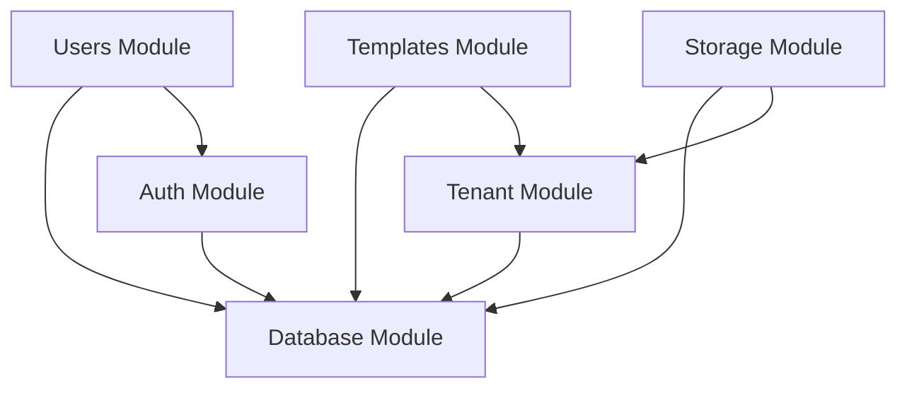

# Architecture Documentation

Comprehensive architecture documentation for the Complytude platform.

## Table of Contents

- [System Overview](#system-overview)
- [Technology Stack](#technology-stack)
- [Architecture Patterns](#architecture-patterns)
- [Module Architecture](#module-architecture)
- [Database Architecture](#database-architecture)
- [Multi-Tenancy Implementation](#multi-tenancy-implementation)
- [Authentication & Authorization](#authentication--authorization)
- [Storage Architecture](#storage-architecture)
- [API Design](#api-design)
- [Security Architecture](#security-architecture)

---

## System Overview

Complytude is a **multi-tenant SaaS platform** for UAE legal document generation and compliance management, built with modern backend architecture principles.

### High-Level Architecture

```
┌─────────────────────────────────────────────────────────────────┐
│                        Client Layer                              │
│  Web App (React/Next.js) • Mobile App • API Consumers           │
└─────────────────────────────────────────────────────────────────┘
                              ↓
┌─────────────────────────────────────────────────────────────────┐
│                     API Gateway / Load Balancer                  │
│                      (nginx / AWS ALB)                           │
└─────────────────────────────────────────────────────────────────┘
                              ↓
┌─────────────────────────────────────────────────────────────────┐
│                   NestJS Application Layer                       │
│  ┌──────────────┬──────────────┬──────────────┬──────────────┐ │
│  │     Auth     │   Tenants    │  Templates   │   Storage    │ │
│  │    Module    │    Module    │    Module    │    Module    │ │
│  └──────────────┴──────────────┴──────────────┴──────────────┘ │
│  ┌──────────────────────────────────────────────────────────┐   │
│  │  Common: Guards, Interceptors, Pipes, Decorators        │   │
│  └──────────────────────────────────────────────────────────┘   │
└─────────────────────────────────────────────────────────────────┘
                              ↓
┌─────────────────────────────────────────────────────────────────┐
│                      Data Layer                                  │
│  ┌────────────────────────┬─────────────────────────────────┐   │
│  │   PostgreSQL 16        │    S3-Compatible Storage        │   │
│  │  (with RLS policies)   │    (MinIO / AWS S3)             │   │
│  └────────────────────────┴─────────────────────────────────┘   │
└─────────────────────────────────────────────────────────────────┘
```

### Key Architectural Decisions

| Decision           | Choice                    | Rationale                                         |
| ------------------ | ------------------------- | ------------------------------------------------- |
| **Framework**      | NestJS 11 with Fastify    | Performance, modularity, TypeScript-first         |
| **Database**       | PostgreSQL 16             | JSONB support, RLS for multi-tenancy, reliability |
| **Multi-Tenancy**  | Row-Level Security (RLS)  | Strong data isolation at database level           |
| **Authentication** | JWT with Passport         | Stateless, scalable, industry standard            |
| **Storage**        | S3-compatible (MinIO/AWS) | Scalable, tenant-isolated buckets                 |
| **Validation**     | class-validator           | Declarative, type-safe validation                 |
| **Documentation**  | Swagger/OpenAPI           | Auto-generated, interactive API docs              |

---

## Technology Stack

### Backend Framework

- **NestJS 11** - Modern TypeScript framework with dependency injection
- **Fastify** - High-performance HTTP server (default in NestJS 11)
- **TypeScript 5** - Type safety and modern JavaScript features

### Database & ORM

- **PostgreSQL 16** - Relational database with advanced features
- **Raw SQL** - Direct SQL for migrations and complex queries
- **Row-Level Security (RLS)** - Database-level tenant isolation

### Authentication & Security

- **Passport.js** - Authentication middleware
- **JWT** - Stateless token-based authentication
- **bcrypt** - Password hashing
- **class-validator** - Input validation

### Storage

- **MinIO** (Development) - S3-compatible object storage
- **AWS S3** (Production) - Cloud object storage

### Documentation & Testing

- **Swagger/OpenAPI** - API documentation
- **Jest** - Unit testing framework
- **Supertest** - E2E API testing

### DevOps

- **Docker** - Containerization
- **Docker Compose** - Local development orchestration
- **pnpm** - Fast, disk-efficient package manager

---

## Architecture Patterns

### 1. Clean Architecture

Complytude follows clean architecture principles with clear separation of concerns:

```
src/
├── modules/              # Feature modules (business logic)
│   ├── auth/            # Authentication & authorization
│   ├── tenants/         # Multi-tenancy management
│   ├── users/           # User management
│   ├── invitations/     # Tenant invitations & membership
│   ├── templates/       # Template CRUD
│   └── storage/         # File storage
├── common/              # Cross-cutting concerns
│   ├── guards/         # Authorization guards
│   ├── interceptors/   # Request/response transformation
│   ├── decorators/     # Custom decorators
│   └── pipes/          # Validation pipes
├── config/             # Configuration management
└── database/           # Database connection & utilities
```

### 2. Dependency Injection

All services use NestJS's DI container:

```typescript
@Injectable()
export class TemplateService {
  constructor(
    private readonly databaseService: DatabaseService,
    private readonly storageService: StorageService,
  ) {}
}
```

**Benefits:**

- Loose coupling
- Easy testing (mocking)
- Clear dependencies

### 3. Decorator-Based Authorization

Authorization is handled via decorators and guards at the route level:

```typescript
@AuthOptions({ tenant: true })
@UseGuards(RolesGuard)
@Roles('admin', 'member')
@Get()
async findAll(@CurrentUserTenant() user: AuthenticatedTenantUser) {
  return this.service.findAll(user.tenantId);
}
```

### 4. DTO Validation

All inputs are validated using DTOs:

```typescript
export class CreateTemplateDto {
  @IsString()
  @IsNotEmpty()
  name: string;

  @IsUUID()
  categoryId: string;

  @IsOptional()
  @IsEnum(TemplateStatus)
  status?: TemplateStatus;
}
```

---

## Module Architecture

### Module Structure

Each module follows a consistent structure:

```
modules/feature/
├── feature.module.ts        # Module definition
├── feature.controller.ts    # HTTP endpoints
├── feature.service.ts       # Business logic
├── dto/                     # Data Transfer Objects
│   ├── create-feature.dto.ts
│   └── update-feature.dto.ts
└── entities/                # Type definitions (optional)
    └── feature.entity.ts
```

### Module Dependencies



### Core Modules

| Module          | Responsibility                                                          | Dependencies                 |
| --------------- | ----------------------------------------------------------------------- | ---------------------------- |
| **auth**        | JWT authentication, signup, login, token refresh, user invitation flows | users, invitations, database |
| **users**       | User management, profile updates                                        | database                     |
| **tenants**     | Tenant creation, subscription management                                | users, database              |
| **invitations** | Tenant invitations, accept/reject, admin management                     | users, tenants, database     |
| **templates**   | Template CRUD, versioning                                               | storage, database            |
| **storage**     | File upload/download, S3 integration                                    | tenants, database            |
| **health**      | Health checks for services                                              | database, storage            |

---

## Database Architecture

### Schema Overview

The database uses a **multi-tenant architecture** with Row-Level Security (RLS) for data isolation.

**For detailed database documentation, see [DATABASE.md](DATABASE.md)**

### Table Categories

1. **Core Tables** (3)
   - `tenants` - Organizations
   - `users` - User accounts
   - `user_tenants` - Many-to-many with roles

2. **Authentication Tables** (3)
   - `refresh_tokens` - JWT refresh tokens
   - `email_verifications` - Email verification tokens
   - `password_resets` - Password reset tokens

3. **Global Reference Tables** (8)
   - `authorities`, `categories` - Reference data
   - `templates`, `template_versions` - Templates with versioning
   - `rulesets`, `ruleset_versions` - Legal rulesets with versioning

4. **Tenant-Scoped Tables** (1)
   - `documents` - Generated documents (RLS enabled)

5. **Junction Tables** (2)
   - `template_rulesets` - Templates ↔ Rulesets
   - `template_version_ruleset_versions` - Version associations

### ER Diagram

View the complete ER diagram:

**📁 File:** `docs/database-schema.dbml`

**View online:**

1. Go to [dbdiagram.io](https://dbdiagram.io/)
2. Copy contents of `database-schema.dbml`
3. Paste into editor

---

## Multi-Tenancy Implementation

### Strategy: Row-Level Security (RLS)

Complytude uses PostgreSQL's Row-Level Security for tenant isolation:

**Advantages:**

- ✅ Strong isolation at database level
- ✅ No application-level filtering needed
- ✅ Automatic enforcement (can't be bypassed)
- ✅ Minimal performance overhead

### How It Works

1. **Application sets session context:**

   ```typescript
   @Injectable()
   export class TenantContextService {
     async setContext(tenantId: string, role: string, isAuthFlow = false) {
       // Set tenant context (transaction-local)
       await this.db.query(`SELECT set_config('app.tenant_id', $1, true)`, [
         tenantId,
       ]);

       // Set user-tenant role (transaction-local)
       await this.db.query(
         `SELECT set_config('app.user_tenant_role', $2, true)`,
         [role],
       );

       // Set auth flow flag if needed (transaction-local)
       if (isAuthFlow) {
         await this.db.query(
           `SELECT set_config('app.is_auth_flow', 'true', true)`,
         );
       }
     }
   }
   ```

2. **RLS policies filter automatically:**

   ```sql
   CREATE POLICY documents_select ON documents
   FOR SELECT USING (
       tenant_id = current_tenant_id_or_null()
   );
   ```

3. **Result:** Users only see their tenant's data

### Tenant Context Flow

```
Request → JWT Validation → Extract tenant_id → Set Session Context → Execute Query → RLS Filters → Response
```

### Global vs Tenant-Scoped Tables

| Type              | Tables                             | RLS    | Access                    |
| ----------------- | ---------------------------------- | ------ | ------------------------- |
| **Global**        | authorities, categories, templates | ❌ No  | Shared across all tenants |
| **Tenant-Scoped** | documents                          | ✅ Yes | Isolated per tenant       |

---

## Authentication & Authorization

### JWT-Based Authentication

**Dual-Token Authentication System:**

Complytude implements a sophisticated dual-token authentication system that separates identity verification from tenant-specific access:

```
┌────────────┐         ┌──────────────┐         ┌──────────────┐
│   Client   │         │   NestJS     │         │  PostgreSQL  │
└────────────┘         └──────────────┘         └──────────────┘
      │                       │                         │
      │  1. Login Request     │                         │
      ├──────────────────────>│                         │
      │                       │  2. Validate Credentials│
      │                       ├────────────────────────>│
      │                       │<────────────────────────│
      │  3. Identity Tokens   │                         │
      │  (Access + Refresh)   │                         │
      │<──────────────────────│                         │
      │                       │                         │
      │  4. Tenant Selection  │                         │
      │  + Identity Token     │                         │
      ├──────────────────────>│                         │
      │                       │  5. Validate Identity   │
      │                       │  6. Generate Tenant Tokens│
      │  7. Tenant Tokens     │                         │
      │  (Access + Refresh)   │                         │
      │<──────────────────────│                         │
      │                       │                         │
      │  8. API Request       │                         │
      │  + Tenant Access Token│                         │
      ├──────────────────────>│                         │
      │                       │  9. Validate JWT        │
      │                       │  10. Set Tenant Context │
      │                       ├────────────────────────>│
      │                       │  11. Query (RLS applies)│
      │                       │<────────────────────────│
      │  12. Response         │                         │
      │<──────────────────────│                         │
```

**System Admin Flow:**

- System admins receive identity tokens and can access system-wide endpoints
- They can optionally select a tenant to receive tenant tokens for tenant-specific operations

### Token Strategy

The system uses **four distinct token types**:

1. **Identity Access Token:** Short-lived (15 minutes), contains user identity and global roles, used for tenant selection and system admin operations
2. **Identity Refresh Token:** Long-lived (14 days), used to obtain new identity access tokens
3. **Tenant Access Token:** Short-lived (30 minutes), contains user + tenant info, used for tenant-scoped API access
4. **Tenant Refresh Token:** Long-lived (14 days), tenant-specific, used to obtain new tenant access tokens

All tokens are stored in HTTP-only cookies and refresh tokens are persisted in the database with type tracking (`identity` or `tenant`).

### Authorization Levels

1. **Route-Level:** `JwtAuthGuard` with `@AuthOptions()` decorator validates required tokens
2. **Identity-Level:** Identity tokens for user verification and system admin access
3. **Tenant-Level:** Tenant tokens provide tenant-scoped access
4. **Role-Level:** `@Roles()` decorator + `RolesGuard` for RBAC
5. **Data-Level:** RLS policies enforce tenant isolation at database level

### Authentication Decorators

```typescript
// Public endpoint (no authentication)
@Get('public')
async publicEndpoint() { }

// Requires identity token only
@AuthOptions({ identity: true })
@Get('profile')
async getProfile(@CurrentUserIdentity() identity: AuthenticatedIdentityUser) { }

// Requires tenant token only
@AuthOptions({ tenant: true })
@Get('documents')
async listDocuments(@CurrentUserTenant() tenant: AuthenticatedTenantUser) { }

// Requires both tokens
@AuthOptions({ identity: true, tenant: true })
@Get('admin/tenant-info')
async getTenantInfo(
  @CurrentUserIdentity() identity: AuthenticatedIdentityUser,
  @CurrentUserTenant() tenant: AuthenticatedTenantUser,
) { }
```

---

## Storage Architecture

### S3-Compatible Storage

Uses S3-compatible object storage with tenant-isolated buckets:

```
Bucket Structure:
complytude-{tenant-id}/
├── templates/
│   └── {template-id}/
│       └── versions/
│           └── {version-id}.docx
└── documents/
    └── {document-id}/
        └── {filename}.pdf
```

### Storage Service

```typescript
@Injectable()
export class StorageService {
  async uploadFile(
    tenantId: string,
    file: Buffer,
    path: string,
  ): Promise<string> {
    const bucket = `complytude-${tenantId}`;
    await this.ensureBucketExists(bucket);
    return this.s3Client.upload(bucket, path, file);
  }
}
```

### Features

- ✅ Tenant-isolated buckets
- ✅ Pre-signed URLs for secure access
- ✅ File size limits (configurable per plan)
- ✅ Automatic bucket creation

---

## API Design

### RESTful Principles

All endpoints follow REST conventions:

| Method | Endpoint             | Action             |
| ------ | -------------------- | ------------------ |
| GET    | `/api/templates`     | List all templates |
| GET    | `/api/templates/:id` | Get one template   |
| POST   | `/api/templates`     | Create template    |
| PATCH  | `/api/templates/:id` | Update template    |
| DELETE | `/api/templates/:id` | Delete template    |

### Response Format

**Success:**

```json
{
  "id": "uuid",
  "name": "Template Name",
  "status": "active",
  "createdAt": "2026-01-20T10:00:00Z"
}
```

**Error:**

```json
{
  "statusCode": 400,
  "message": "Validation failed",
  "error": "Bad Request"
}
```

### API Versioning

API prefix: `/api` (v1 is implicit)

Future versions: `/api/v2`

### Documentation

Interactive API docs available at:

- **Development:** http://localhost:3000/docs
- **Swagger JSON:** http://localhost:3000/docs-json

---

## Security Architecture

### Security Layers

1. **Transport Layer:** HTTPS (production)
2. **Authentication:** JWT tokens
3. **Authorization:** Guards + RLS
4. **Input Validation:** class-validator
5. **Output Sanitization:** Interceptors
6. **Rate Limiting:** (planned)

### Security Features

- ✅ Bcrypt password hashing (10 rounds)
- ✅ JWT secrets rotation ready
- ✅ CORS configuration
- ✅ SQL injection prevention (parameterized queries)
- ✅ XSS prevention (validation)
- ✅ Row-Level Security for data isolation
- ✅ Helmet security headers (planned)

### Environment Variables

Sensitive configuration via environment variables:

```bash
JWT_ACCESS_SECRET=<secret>
JWT_REFRESH_SECRET=<secret>
DB_PASSWORD=<secret>
S3_SECRET_KEY=<secret>
```

**Never commit secrets to version control.**

---

## Performance Considerations

### Database Optimization

- Composite indexes for tenant-scoped queries
- Partial indexes for common filters
- Connection pooling (configurable)
- Query result caching (planned)

### Application Optimization

- Fastify for high-performance HTTP
- Dependency injection for efficient resource use
- Lazy module loading
- Response compression (planned)

### Scalability

- Stateless design (horizontal scaling)
- Database read replicas (planned)
- CDN for static assets (planned)
- Redis caching layer (planned)

---

## Related Documentation

- [DATABASE.md](DATABASE.md) - Detailed database schema
- [DEPLOYMENT.md](DEPLOYMENT.md) - Deployment guide
- [DEVELOPMENT.md](DEVELOPMENT.md) - Development workflow
- [Main README](../README.md) - Project overview

---

**Last Updated:** January 20, 2026
