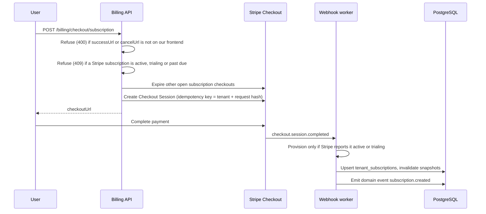
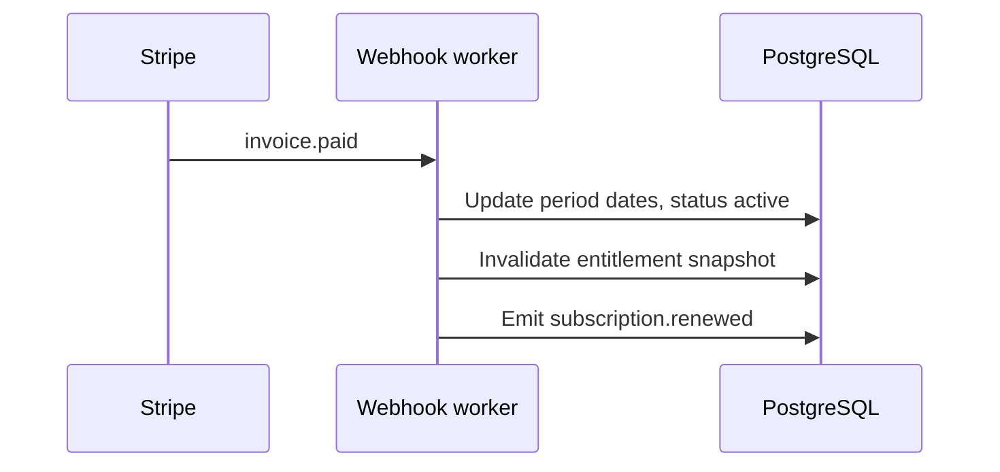
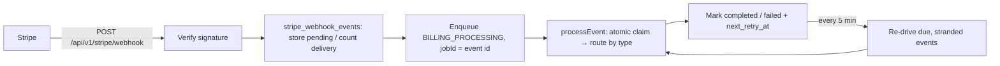

# Billing Architecture (Stripe)

**Version:** 1.0
**Last Updated:** March 26, 2026
**Status:** Implemented

---

## Table of Contents

- [Overview](#overview)
- [Source of Truth](#source-of-truth)
- [Stripe Object Model Mapping](#stripe-object-model-mapping)
- [System Components](#system-components)
- [Data Flows](#data-flows)
- [Database Schema (Billing-Related)](#database-schema-billing-related)
- [Webhook Processing](#webhook-processing)
- [Webhook Event Catalog](#webhook-event-catalog)
- [Domain Events](#domain-events)
- [Related Documentation](#related-documentation)

---

## Overview

Complytude uses **Stripe** for subscription billing, one-time credit purchases, and the Customer Portal. **Entitlements** (what a tenant can do—quotas, features, seats) are enforced from **our PostgreSQL database**, updated when Stripe-driven events are processed.

**High-level split:**

| Concern                                                     | System of record                                        |
| ----------------------------------------------------------- | ------------------------------------------------------- |
| Payment method, invoices, subscription lifecycle in Stripe  | **Stripe**                                              |
| Plan catalog keys, feature matrices, usage, credits balance | **Our DB** (synced or mutated by webhooks and services) |
| Webhook durability and idempotency                          | **`stripe_webhook_events`** table                       |

---

## Source of Truth

### Stripe-driven (authoritative from Stripe after sync)

- **Stripe Customer ID** on `tenants.stripe_customer_id`
- **Stripe Subscription ID**, schedule ID, and Stripe-reported period end on `tenant_subscriptions` (`stripe_subscription_id`, `stripe_schedule_id`, `stripe_current_period_end`, `stripe_status`)
- **Invoice payment outcome** (paid vs failed) as reflected in webhooks
- **Price IDs** on `plans` and `addons` after catalog sync (`stripe_product_id`, `stripe_price_id_*`)
- **Credit package** Stripe Product/Price IDs in `credit_packages` after catalog sync

### Our DB–driven (application semantics)

- **Internal subscription `status`** — mapped from Stripe (`mapStripeStatusToInternal`) but includes operational states we set (e.g. `past_due`)
- **Effective entitlements** — resolved from `plans`, `tenant_addons`, `tenant_overrides`, `tenant_subscriptions` via `EntitlementResolverService`
- **Usage** — `usage_ledger`, `aggregated_usage` (not duplicated in Stripe)
- **Credit balance** — `credit_ledger` (Stripe only records the payment; fulfillment is our ledger)

### Catalog sync

Plans, add-ons, and credit packages are defined in code constants and synced to Stripe Products/Prices when **`STRIPE_CATALOG_SYNC_ENABLED=true`** (startup / manual `POST /api/v1/admin/stripe/sync-catalog`). Stripe IDs are persisted on `plans`, `addons`, and `credit_packages`. The same sync keeps the Customer Portal configuration (below) in step with the catalog.

---

## Stripe Object Model Mapping

| Stripe object                             | Role                         | Our storage                                                                                              | Notes                                                                                |
| ----------------------------------------- | ---------------------------- | -------------------------------------------------------------------------------------------------------- | ------------------------------------------------------------------------------------ |
| **Customer** (`cus_*`)                    | Billable entity              | `tenants.stripe_customer_id`                                                                             | Created on tenant creation (fire-and-forget); metadata may include `creator_user_id` |
| **Product**                               | Sellable product             | `plans.stripe_product_id`, `addons.stripe_product_id`, `credit_packages` (product id)                    | Navigator may have no Stripe product                                                 |
| **Price** (`price_*`)                     | Recurring or one-time amount | `plans.stripe_price_id_monthly` / `_annual`, `addons.stripe_price_id`, `credit_packages.stripe_price_id` | Checkout resolves price by plan + interval or package key                            |
| **Subscription** (`sub_*`)                | Recurring billing            | `tenant_subscriptions.stripe_subscription_id`                                                            | Null for free Navigator-only tenants                                                 |
| **Subscription Schedule** (`sub_sched_*`) | Scheduled plan changes       | `tenant_subscriptions.stripe_schedule_id`                                                                | Cleared after change applies                                                         |
| **Checkout Session** (`cs_*`)             | Hosted checkout              | Not stored long-term; drives webhook handling                                                            | Metadata: `complytude_tenant_id`, `plan_key` or credit package fields                |
| **Invoice** (`in_*`)                      | Payment attempt / receipt    | Not a first-class table; fields embedded in subscription metadata or event processing                    | `invoice.paid` / `invoice.payment_failed` drive renewal and dunning                  |

---

## System Components

| Area                     | Location (API app)                                                                                  |
| ------------------------ | --------------------------------------------------------------------------------------------------- |
| Tenant billing HTTP API  | `apps/api/src/modules/stripe/controllers/billing.controller.ts`                                     |
| Stripe webhook ingress   | `apps/api/src/modules/stripe/webhook/stripe-webhook.controller.ts` → `POST .../stripe/webhook`      |
| Async webhook processing | `BILLING_PROCESSING` queue → `StripeWebhookProcessingHandler` → `StripeWebhookService`              |
| Event handlers           | `apps/api/src/modules/stripe/webhook/stripe-event-handlers/index.ts` (`StripeEventHandlersService`) |
| Catalog sync             | `StripeCatalogSyncService`, `StripeCatalogModule`                                                   |
| Reconciliation           | `StripeReconciliationService` (+ admin endpoint)                                                    |
| Customer creation        | `StripeCustomerService` (tenant onboarding)                                                         |

---

## Data Flows

### Subscription checkout (new paid plan)

### Past-due policy

A failed renewal payment does not lock the tenant out immediately:

- **Days 0–7 (grace):** full access. The grace clock starts at the first failed payment of the episode (`tenant_subscriptions.metadata.past_due_since`) and is not restarted by Stripe's retries.
- **After day 7 (read-only):** the resolver sets every counted feature (quota, metered, capacity) to 0 and marks it `restricted: 'payment_required'`; `checkAndRecord` refuses it without trying credits, and the route answers 402 with `reason: 'payment_required'` (not the quota-exceeded body). Boolean and text features, i.e. what the tenant can read, are unchanged.
- **Paid:** `invoice.paid` / `customer.subscription.updated` with Stripe status active clears `past_due_since`; full access returns immediately (the snapshot is invalidated).
- **Stripe gives up:** `customer.subscription.deleted` downgrades to Navigator as before.

The rule lives in `pastDueAccess()` (`modules/entitlements/utils/past-due-access.util.ts`, `PAST_DUE_GRACE_DAYS` in `billing.constant.ts`). An entitlement snapshot taken during the grace period expires when it ends (`__valid_until`). `GET /billing/status` reports `dunning.grace_ends_at` and `dunning.read_only`.

**Dunning emails** (day 0, 3 and 5) are queued once per invoice (`jobId = dunning-<invoice>-<step>`), however many times Stripe retries, and each is skipped if the invoice is no longer open when it is due.

### Duplicate protection

- **One Stripe customer per tenant:** `customers.create` uses `idempotencyKey = 'customer:' + tenantId` with parameters derived only from the tenant, runs outside any DB transaction, and the first ID stored on `tenants.stripe_customer_id` wins. The signup job, checkout and the portal all go through the same path.
- **Checkout:** see the diagram above. Stripe replays a key's original response for 24 h, so a replayed session is re-read and, if it has completed or expired since, a new one is opened.
- **Add-on items:** `idempotencyKey = 'addon-item:' + subscription + addon + previous adds`, so a double click creates one item and a re-add after removal a new one.
- **Plan-change schedules:** a schedule Stripe already attached to the subscription is reused rather than created again.
- The Stripe client retries network failures twice (`maxNetworkRetries: 2`, 30 s timeout); the SDK adds an idempotency key to every retried request.

### Redirects and the Customer Portal

- **Redirect allowlist:** checkout `successUrl`/`cancelUrl` and the portal `returnUrl` must be on the origin of `FRONTEND_URL` or one of `CORS_ORIGINS`; anything else is refused with 400 before Stripe is called, so a Stripe-hosted page can't send the customer to another site.
- **Portal configuration:** every portal session uses the configuration the catalog sync manages (`metadata.managed_by = complytude`; `StripePortalConfigurationService`), never the dashboard default. Customers can update their details, tax id and payment method and see invoices; plan switches are limited to our active plans' monthly and annual prices, and cancelling takes effect at the end of the period. Change it in code, not in the Stripe dashboard: the next sync overwrites it.

### Recurring renewal

### Webhook ingress (async)

---

## Database Schema (Billing-Related)

Key tables (see also [DATABASE.md](DATABASE.md)):

| Table                   | Purpose                                                                         |
| ----------------------- | ------------------------------------------------------------------------------- |
| `tenants`               | `stripe_customer_id`                                                            |
| `plans`                 | Stripe product/price IDs for paid tiers                                         |
| `addons`                | Stripe product/price for add-ons                                                |
| `credit_packages`       | Credit bundle definitions + Stripe IDs after sync                               |
| `tenant_subscriptions`  | Plan, periods, `stripe_*` fields, JSON `metadata` (dunning, cancellation flags) |
| `tenant_addons`         | `stripe_subscription_item_id`                                                   |
| `credit_ledger`         | Purchases, grants, deductions; Stripe refs on purchase rows                     |
| `stripe_webhook_events` | Idempotency, payload storage, processing status, `deliveries` vs processing `attempts`, `next_retry_at` |

---

## Webhook Processing

1. **Signature:** Raw body + `STRIPE_WEBHOOK_SECRET` (`constructWebhookEvent`). An event whose `livemode` doesn't match `STRIPE_MODE` is refused as well: it comes from the other Stripe account mode.
2. **Persistence:** A new event is stored in `stripe_webhook_events` as `pending`; a repeat delivery only increments `deliveries`. If the event is already `completed`, the endpoint returns 200 without queueing.
3. **Async:** Processing runs in a BullMQ job (`jobId` = the Stripe event ID, so a repeat delivery doesn't queue a second job) with 5 attempts over about 30 s.
4. **At most once at a time:** `processEvent` claims the event atomically (`pending`/`failed` → `processing`, incrementing `attempts`), so a duplicate delivery or a second worker skips it. A `processing` claim older than 15 minutes is treated as a crashed worker and can be claimed again.
5. **Idempotent effects:** Credit purchases carry `idempotency_key = 'checkout:' + session id`, so re-processing a checkout never grants credits twice.
6. **Order-independent:** Subscription and invoice handlers re-fetch the subscription (and invoice) from Stripe and apply its current state, so late or out-of-order events can't roll state back.
7. **Re-drive:** A failed attempt sets `next_retry_at`: after the queue's attempts, the delay doubles from 1 minute up to 6 hours, for up to 20 attempts (about two days). The `stripe-webhook-redrive` job (every 5 minutes, scheduled with the reconciliation job) processes due failed events, `pending` events older than 10 minutes (lost job) and stale `processing` claims. While any event is `failed` it logs an error starting `Stripe webhook events failing:`; alarm on that line.
8. **Manual retry:** `POST /api/v1/admin/stripe/retry-failed-webhooks` retries every failed event now, including events out of automatic retries.

Unhandled event types are logged and acknowledged (no hard failure).

---

## Webhook Event Catalog

Events **routed** in `StripeWebhookService` (see `stripe.constants.ts` for full enum of known strings):

| Stripe event                      | Handler                       | Behavior                                                                                                                                                                                      | Domain event(s)                                          |
| --------------------------------- | ----------------------------- | --------------------------------------------------------------------------------------------------------------------------------------------------------------------------------------------- | -------------------------------------------------------- |
| `checkout.session.completed`      | `handleCheckoutCompleted`     | If `metadata.checkout_type=credit_purchase` **or** inferred credit flow → credit purchase; else subscription checkout → if Stripe reports the subscription active or trialing, upsert it with that status, link `stripe_subscription_id`, invalidate caches; one still `incomplete` (first payment pending, e.g. 3-D Secure) is left for `customer.subscription.updated` to adopt | `credit.purchased` (via ledger) / `subscription.created` |
| `customer.subscription.created`   | `handleSubscriptionChange`    | Re-fetch the subscription from Stripe; sync plan from price, status, periods; sync add-on subscription items. A live subscription with no local row is adopted for the tenant in its `complytude_tenant_id` metadata (or its Stripe customer's tenant) | `subscription.created` when adopted; `subscription.plan_changed` only if plan id changed |
| `customer.subscription.updated`   | `handleSubscriptionChange`    | Same as created; if Stripe now reports the subscription canceled or `incomplete_expired` (first payment never came), handled as deleted | `subscription.plan_changed` if plan changed              |
| `customer.subscription.deleted`   | `handleSubscriptionChange`    | Cancel the add-ons billed on that subscription; downgrade to Navigator only if the tenant has no other live subscription (a newer paying one keeps its plan and add-ons). No-op if already cancelled locally | `subscription.cancelled`                                 |
| `invoice.paid`                    | `handleInvoicePaid`           | Advance billing period from the re-fetched Stripe subscription; take its status (another open invoice can keep it `past_due`)                                                                  | `subscription.renewed`                                   |
| `invoice.payment_failed`          | `handleInvoicePaymentFailed`  | Take the re-fetched subscription's status; if the invoice is still open, store failure metadata and queue dunning emails (a failure already paid off does neither)                              | `subscription.payment_failed`                            |
| `invoice.payment_action_required` | `handlePaymentActionRequired` | If the re-fetched invoice is still open: store `payment_action_required` in subscription metadata; queue notification email                                                                    | _(none — metadata update)_                               |
| `charge.refunded`, `charge.dispute.created` / `.updated` / `.closed` / `.funds_withdrawn` / `.funds_reinstated` | `handleChargeReversal` | Re-fetch the charge (and its disputes). If it paid a credit purchase (matched by payment intent), bring the credits taken back to: all of them while a dispute is open or lost (inquiries included), the refunded share rounded up otherwise, none once a dispute is won (`won`, `warning_closed`, `prevented`). The difference is one `reversal` ledger row; the balance may go below zero, which blocks spending. Other payments are logged and ignored | `credit.reversed` |

**Webhook endpoint events:** the Stripe dashboard endpoint (test and live) must send every event in the table above, the `charge.*` ones included; an event it doesn't send is never handled. `stripe listen` forwards all events locally.

**Note:** The ticket’s shorthand names (`CheckoutCompletedHandler`, etc.) map to **`StripeEventHandlersService`** methods (`handleCheckoutCompleted`, `handleSubscriptionChange`, `handleInvoicePaid`, `handleInvoicePaymentFailed`).

---

## Domain Events

Emitted to `domain_events` (see [ENTITLEMENTS.md](ENTITLEMENTS.md#domain-events)) for billing-related flows, including:

- `subscription.created`
- `subscription.plan_changed`
- `subscription.cancelled`
- `subscription.renewed`
- `subscription.payment_failed`
- `credit.purchased`

---

## Related Documentation

- [ENTITLEMENTS.md](ENTITLEMENTS.md) — Plans, usage, credits, domain events
- [STRIPE_DEVELOPMENT.md](STRIPE_DEVELOPMENT.md) — Local Stripe setup, CLI, test cards
- [BILLING_RUNBOOK.md](BILLING_RUNBOOK.md) — Operations, reconciliation, troubleshooting
- [API Contracts — Billing](../apps/api/docs/API_CONTRACTS.md#billing-api) — HTTP endpoints
- [ARCHITECTURE.md](ARCHITECTURE.md) — Tenant creation and Stripe customer side effect

---

[Back to documentation index](README.md)
