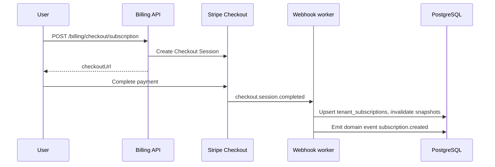
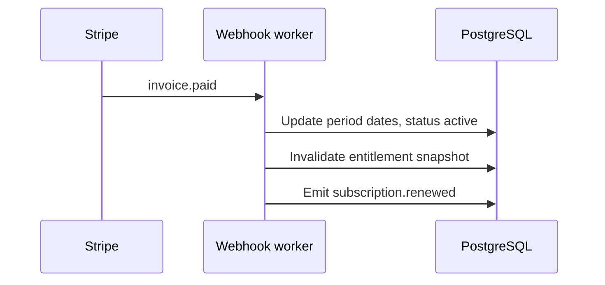
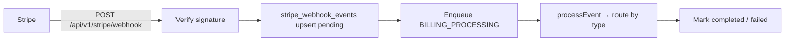

# Billing Architecture (Stripe)

**Version:** 1.0
**Last Updated:** March 26, 2026
**Status:** Implemented

---

## Table of Contents

- [Overview](#overview)
- [Source of Truth](#source-of-truth)
- [Stripe Object Model Mapping](#stripe-object-model-mapping)
- [System Components](#system-components)
- [Data Flows](#data-flows)
- [Database Schema (Billing-Related)](#database-schema-billing-related)
- [Webhook Processing](#webhook-processing)
- [Webhook Event Catalog](#webhook-event-catalog)
- [Domain Events](#domain-events)
- [Related Documentation](#related-documentation)

---

## Overview

Complytude uses **Stripe** for subscription billing, one-time credit purchases, and the Customer Portal. **Entitlements** (what a tenant can do—quotas, features, seats) are enforced from **our PostgreSQL database**, updated when Stripe-driven events are processed.

**High-level split:**

| Concern                                                     | System of record                                        |
| ----------------------------------------------------------- | ------------------------------------------------------- |
| Payment method, invoices, subscription lifecycle in Stripe  | **Stripe**                                              |
| Plan catalog keys, feature matrices, usage, credits balance | **Our DB** (synced or mutated by webhooks and services) |
| Webhook durability and idempotency                          | **`stripe_webhook_events`** table                       |

---

## Source of Truth

### Stripe-driven (authoritative from Stripe after sync)

- **Stripe Customer ID** on `tenants.stripe_customer_id`
- **Stripe Subscription ID**, schedule ID, and Stripe-reported period end on `tenant_subscriptions` (`stripe_subscription_id`, `stripe_schedule_id`, `stripe_current_period_end`, `stripe_status`)
- **Invoice payment outcome** (paid vs failed) as reflected in webhooks
- **Price IDs** on `plans` and `addons` after catalog sync (`stripe_product_id`, `stripe_price_id_*`)
- **Credit package** Stripe Product/Price IDs in `credit_packages` after catalog sync

### Our DB–driven (application semantics)

- **Internal subscription `status`** — mapped from Stripe (`mapStripeStatusToInternal`) but includes operational states we set (e.g. `past_due`)
- **Effective entitlements** — resolved from `plans`, `tenant_addons`, `tenant_overrides`, `tenant_subscriptions` via `EntitlementResolverService`
- **Usage** — `usage_ledger`, `aggregated_usage` (not duplicated in Stripe)
- **Credit balance** — `credit_ledger` (Stripe only records the payment; fulfillment is our ledger)

### Catalog sync

Plans, add-ons, and credit packages are defined in code constants and synced to Stripe Products/Prices when **`STRIPE_CATALOG_SYNC_ENABLED=true`** (startup / manual `POST /api/v1/admin/stripe/sync-catalog`). Stripe IDs are persisted on `plans`, `addons`, and `credit_packages`.

---

## Stripe Object Model Mapping

| Stripe object                             | Role                         | Our storage                                                                                              | Notes                                                                                |
| ----------------------------------------- | ---------------------------- | -------------------------------------------------------------------------------------------------------- | ------------------------------------------------------------------------------------ |
| **Customer** (`cus_*`)                    | Billable entity              | `tenants.stripe_customer_id`                                                                             | Created on tenant creation (fire-and-forget); metadata may include `creator_user_id` |
| **Product**                               | Sellable product             | `plans.stripe_product_id`, `addons.stripe_product_id`, `credit_packages` (product id)                    | Navigator may have no Stripe product                                                 |
| **Price** (`price_*`)                     | Recurring or one-time amount | `plans.stripe_price_id_monthly` / `_annual`, `addons.stripe_price_id`, `credit_packages.stripe_price_id` | Checkout resolves price by plan + interval or package key                            |
| **Subscription** (`sub_*`)                | Recurring billing            | `tenant_subscriptions.stripe_subscription_id`                                                            | Null for free Navigator-only tenants                                                 |
| **Subscription Schedule** (`sub_sched_*`) | Scheduled plan changes       | `tenant_subscriptions.stripe_schedule_id`                                                                | Cleared after change applies                                                         |
| **Checkout Session** (`cs_*`)             | Hosted checkout              | Not stored long-term; drives webhook handling                                                            | Metadata: `complytude_tenant_id`, `plan_key` or credit package fields                |
| **Invoice** (`in_*`)                      | Payment attempt / receipt    | Not a first-class table; fields embedded in subscription metadata or event processing                    | `invoice.paid` / `invoice.payment_failed` drive renewal and dunning                  |

---

## System Components

| Area                     | Location (API app)                                                                                  |
| ------------------------ | --------------------------------------------------------------------------------------------------- |
| Tenant billing HTTP API  | `apps/api/src/modules/stripe/controllers/billing.controller.ts`                                     |
| Stripe webhook ingress   | `apps/api/src/modules/stripe/webhook/stripe-webhook.controller.ts` → `POST .../stripe/webhook`      |
| Async webhook processing | `BILLING_PROCESSING` queue → `StripeWebhookProcessingHandler` → `StripeWebhookService`              |
| Event handlers           | `apps/api/src/modules/stripe/webhook/stripe-event-handlers/index.ts` (`StripeEventHandlersService`) |
| Catalog sync             | `StripeCatalogSyncService`, `StripeCatalogModule`                                                   |
| Reconciliation           | `StripeReconciliationService` (+ admin endpoint)                                                    |
| Customer creation        | `StripeCustomerService` (tenant onboarding)                                                         |

---

## Data Flows

### Subscription checkout (new paid plan)

### Recurring renewal

### Webhook ingress (async)

---

## Database Schema (Billing-Related)

Key tables (see also [DATABASE.md](DATABASE.md)):

| Table                   | Purpose                                                                         |
| ----------------------- | ------------------------------------------------------------------------------- |
| `tenants`               | `stripe_customer_id`                                                            |
| `plans`                 | Stripe product/price IDs for paid tiers                                         |
| `addons`                | Stripe product/price for add-ons                                                |
| `credit_packages`       | Credit bundle definitions + Stripe IDs after sync                               |
| `tenant_subscriptions`  | Plan, periods, `stripe_*` fields, JSON `metadata` (dunning, cancellation flags) |
| `tenant_addons`         | `stripe_subscription_item_id`                                                   |
| `credit_ledger`         | Purchases, grants, deductions; Stripe refs on purchase rows                     |
| `stripe_webhook_events` | Idempotency, payload storage, processing status                                 |

---

## Webhook Processing

1. **Signature:** Raw body + `STRIPE_WEBHOOK_SECRET` (`constructWebhookEvent`).
2. **Idempotency:** If `stripe_event_id` already `completed`, return 200 immediately.
3. **Persistence:** Event JSON stored in `stripe_webhook_events` with status `pending` → `processing` → `completed` or `failed`.
4. **Async:** Processing runs in a BullMQ job to avoid Stripe HTTP timeouts.
5. **Retries:** Admin can retry failures via `POST /api/v1/admin/stripe/retry-failed-webhooks`.

Unhandled event types are logged and acknowledged (no hard failure).

---

## Webhook Event Catalog

Events **routed** in `StripeWebhookService` (see `stripe.constants.ts` for full enum of known strings):

| Stripe event                      | Handler                       | Behavior                                                                                                                                                                                      | Domain event(s)                                          |
| --------------------------------- | ----------------------------- | --------------------------------------------------------------------------------------------------------------------------------------------------------------------------------------------- | -------------------------------------------------------- |
| `checkout.session.completed`      | `handleCheckoutCompleted`     | If `metadata.checkout_type=credit_purchase` **or** inferred credit flow → credit purchase; else subscription checkout → upsert subscription, link `stripe_subscription_id`, invalidate caches | `credit.purchased` (via ledger) / `subscription.created` |
| `customer.subscription.created`   | `handleSubscriptionChange`    | Sync plan from price, status, periods; sync add-on subscription items                                                                                                                         | `subscription.plan_changed` only if plan id changed      |
| `customer.subscription.updated`   | `handleSubscriptionChange`    | Same as created                                                                                                                                                                               | `subscription.plan_changed` if plan changed              |
| `customer.subscription.deleted`   | `handleSubscriptionChange`    | Cancel tenant add-ons; downgrade subscription to Navigator; clear Stripe subscription id                                                                                                      | `subscription.cancelled`                                 |
| `invoice.paid`                    | `handleInvoicePaid`           | Advance billing period from Stripe subscription; set active                                                                                                                                   | `subscription.renewed`                                   |
| `invoice.payment_failed`          | `handleInvoicePaymentFailed`  | Set `past_due`, store failure metadata, queue dunning emails                                                                                                                                  | `subscription.payment_failed`                            |
| `invoice.payment_action_required` | `handlePaymentActionRequired` | Store `payment_action_required` in subscription metadata; queue notification email                                                                                                            | _(none — metadata update)_                               |

**Note:** The ticket’s shorthand names (`CheckoutCompletedHandler`, etc.) map to **`StripeEventHandlersService`** methods (`handleCheckoutCompleted`, `handleSubscriptionChange`, `handleInvoicePaid`, `handleInvoicePaymentFailed`).

---

## Domain Events

Emitted to `domain_events` (see [ENTITLEMENTS.md](ENTITLEMENTS.md#domain-events)) for billing-related flows, including:

- `subscription.created`
- `subscription.plan_changed`
- `subscription.cancelled`
- `subscription.renewed`
- `subscription.payment_failed`
- `credit.purchased`

---

## Related Documentation

- [ENTITLEMENTS.md](ENTITLEMENTS.md) — Plans, usage, credits, domain events
- [STRIPE_DEVELOPMENT.md](STRIPE_DEVELOPMENT.md) — Local Stripe setup, CLI, test cards
- [BILLING_RUNBOOK.md](BILLING_RUNBOOK.md) — Operations, reconciliation, troubleshooting
- [API Contracts — Billing](../apps/api/docs/API_CONTRACTS.md#billing-api) — HTTP endpoints
- [ARCHITECTURE.md](ARCHITECTURE.md) — Tenant creation and Stripe customer side effect

---

[Back to documentation index](README.md)
